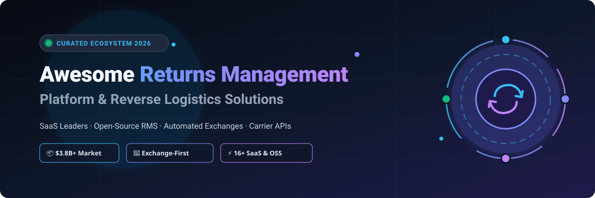
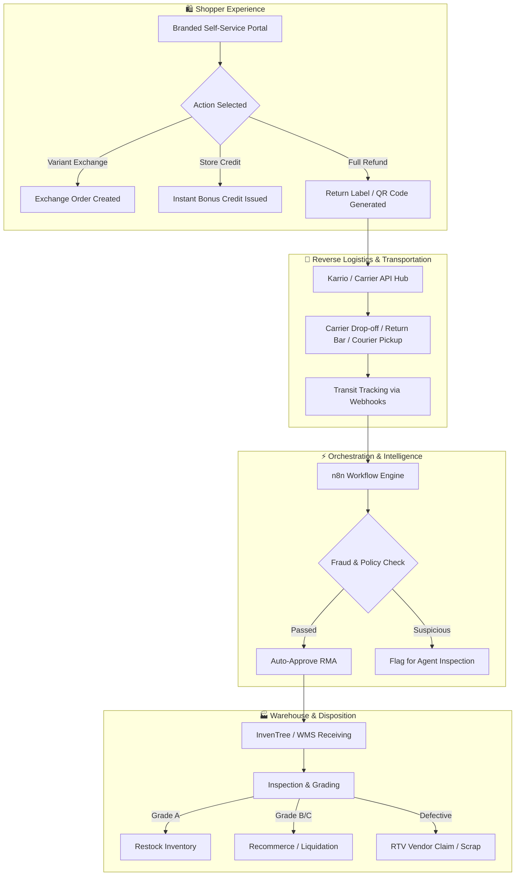

  

  
  
  
  
  
  
  

# 📦 Awesome Returns Management Platform & Reverse Logistics Ecosystem 🔄

Welcome to the definitive, SEO-optimized directory of **Returns Management Platforms (RMS)**, **E-commerce Reverse Logistics Software**, **Automated Exchange Portals**, and **Open-Source RMA Solutions**.

Returns represent an estimated **$700B+ annual challenge** across global retail, with e-commerce return rates regularly hovering between **18% and 30%**. Modern returns management platforms transform cost-heavy reverse logistics into high-retention post-purchase experiences by automating exchanges, issuing instant store credits, generating carrier QR/prepaid labels, preventing return fraud, and accelerating warehouse restocking.

---

## 📑 Table of Contents
- [📊 Market Overview & Industry Structure](#-market-overview--industry-structure)
- [🏢 SaaS & Hosted Platforms](#-saas--hosted-platforms)
- [🔓 Open-Source GitHub Projects](#-open-source-github-projects)
- [🏗️ Architectural Stacks for Custom Returns Engineering](#️-architectural-stacks-for-custom-returns-engineering)
- [🤝 How to Contribute](#-how-to-contribute)
- [📈 Star History](#-star-history)
- [⚖️ Disclaimer](#️-disclaimer)

---

## 📊 Market Overview & Industry Structure

> 💡 **Market Size & Fragmentation**: The global **Returns Management Software (RMS) & Reverse Logistics SaaS market** is estimated at **$3.8 Billion** in 2025–2026, projected to exceed **$9.5 Billion by 2032** growing at a CAGR of **~15.2%**. The sector is **moderately fragmented**: while category champions hold strong platform-specific dominance (e.g., **Loop Returns** and **ReturnGO** on Shopify DTC, **Happy Returns** across physical US return bars, and **Narvar** across enterprise retail), there is **no single winner-take-all monopoly**. This persistent fragmentation is driven by regional carrier networks, localized cross-border customs regulations, varied retail verticals (fashion vs. electronics), and diverse warehouse management system (WMS) architectures.

---

## 🏢 SaaS & Hosted Platforms

The table below catalogs premier commercial returns management platforms, **sorted in descending order by company size (valuation / estimated annual recurring revenue)**. Starting prices and free tier/trial limits are strictly verified.

| Platform | Description / Core Focus | Company Size (Valuation / Revenue) 🏢 | Starting Pricing 💳 | Free Tier / Free Trial Limit 🎁 |
| :--- | :--- | :--- | :--- | :--- |
| **[Narvar](https://corp.narvar.com/)** | Enterprise post-purchase suite covering returns, exchanges, package tracking, 200K+ drop-off locations, and AI-driven shopper communications for global retailers. | **~$1.0B+ Valuation** (Unicorn, $100M+ raised) · ~$80M–$100M+ ARR | **$1,667/month** (Mid-market tier billed annually at ~$20,000–$30,000/yr; enterprise scales to $250,000+/yr) | **0 days** (No public self-serve free trial; custom enterprise proof-of-concept and sandbox testing provided via sales demo) |
| **[AfterShip Returns](https://www.aftership.com/returns)** | Post-purchase returns management suite with automated self-service portal, multi-carrier label generation, and global shipment tracking across 1,000+ couriers. | **~$1.0B+ Valuation** (Tiger Global Series B) · ~$50M+ ARR | **$16/month** (Essentials tier billed annually at $192/yr, or $23/mo billed monthly; includes 20 returns/mo, $0.50/extra return) | **7-day free trial** (up to 20 return requests, full access to carrier label printing, automation rules, and return portal without credit card) |
| **[Happy Returns](https://happyreturns.com/)** | In-person, box-free and label-free return drop-off network (acquired by UPS for $465M) featuring 10,000+ Return Bar physical locations nationwide across the US. | **~$465M Acquisition Valuation** (Subsidiary of UPS, $90B+ logistics giant) · ~$60M–$80M+ ARR | **$350/month** (Estimated starting platform subscription fee plus per-return handling fees under UPS merchant agreements) | **0 days** (No public self-serve free trial; merchant onboarding and pilot testing require sales agreement and carrier contract) |
| **[Loop Returns](https://www.loopreturns.com/)** | Exchange-first returns and reverse-logistics platform (Shopify category leader); automates exchanges, instant bonus credits, and return fraud prevention workflows. | **~$340M–$400M Valuation** ($65M Series B by CRV/Shopify) · ~$35M–$50M ARR | **$155/month** (Essential tier; Advanced starts at $340/mo; also offers $0/mo Checkout+ consumer-funded model) | **Free forever plan** (Checkout+ plan: $0/mo software fee, US/CA labels, and Return Bar drop-offs funded via shopper protection fees) or **14-day free trial** on Shopify |
| **[ParcelLab](https://parcellab.com/solutions/returns)** | Enterprise post-purchase experience and returns management platform (Retain module) providing white-label return portals and proactive customer communication. | **~$150M–$200M Valuation** ($112M Series C by Insight Partners) · ~$25M–$35M ARR | **$1,600/month** (~€1,500/month base Retain module fee, billed annually at ~€18,000–€40,000/yr depending on parcel volume) | **0 days** (No public self-serve free trial; staging sandbox and evaluation environment via sales consultation) |
| **[ReverseLogix](https://www.reverselogix.com/)** | End-to-end Returns Management System (RMS) designed for B2C, B2B, and 3PL supply chains with warehouse inspection, repair, and disposition workflows. | **~$80M–$100M Valuation** ($20M Series A) · ~$25M ARR | **$1,000/month** (Base RMS module tier, billed annually starting at ~$12,000–$25,000/year depending on facility volume) | **0 days** (No public self-serve free trial; sandbox architecture demo and scoping evaluation with RMS specialists) |
| **[ZigZag Global](https://www.zigzag.global/)** | Global returns management solution (acquired by Global-e, Nasdaq: GLBE, $6B+ mcap) providing localized return portals, carrier routing, paperless QR labels, and regional hub consolidation. | **~$70M–$100M Acquisition Valuation** (Part of Global-e) · ~$15M–$20M ARR | **$20/month** (Silver tier; Gold tier at $50/mo, Platinum at $199/mo) | **Free forever plan** for new and small UK retailers; or **14-day free trial** on paid Shopify plans |
| **[ReBOUND Returns](https://www.reboundreturns.com/)** | Global enterprise returns management and cross-border reverse logistics network connecting 500+ carrier services and regional return hubs (Reconomy Group). | **~$30M–$50M Acquisition Valuation** (Part of Reconomy Group, £400M+ turnover) · ~$15M–$20M ARR | **$650/month** (~£500/month base logistics management fee, billed annually based on cross-border return volumes) | **0 days** (No public self-serve free trial; custom logistics pilot and carrier account setup via sales demo) |
| **[ReturnLogic](https://www.returnlogic.com/)** | Returns and reverse supply-chain operations platform for DTC brands, featuring automated RMA management, warranty workflows, and 3PL inventory disposition. | **~$30M–$50M Valuation** ($8.5M Series A by Craft Ventures) · ~$5M–$10M ARR | **$299/month** (Essential subscription tier, 12-month contract) or $3.90/return (starting usage rate scaling to $0.25) | **0 days** (No public self-serve free trial; interactive sandbox staging and guided evaluation provided via product demo) |
| **[ClickPost Returns](https://www.clickpost.ai/returns-management)** | Multi-carrier logistics intelligence and reverse-logistics platform automating courier pickup dispatch, tracking, and non-delivery report (NDR) management. | **~$25M–$40M Valuation** ($4M+ raised) · ~$5M–$8M ARR | **$300/month** (Base logistics/returns tier, ~₹25,000/month, billed annually based on shipment volume) | **0 days** (No public self-serve free trial; staging access and proof-of-concept environment provided via enterprise demo) |
| **[ReturnGO](https://returngo.ai/)** | AI-driven, exchange-first returns and warranty portal offering flexible policy rules, variant/product exchanges, and store credit incentives. | **~$25M–$40M Valuation** ($6.5M+ raised) · ~$5M–$8M ARR | **$147/month** (Premium plan; or entry Return Guard plan from $23/mo; Pro plan at $297/mo) | **14-day free trial** (access to all standard portal and workflow features up to selected plan's return quota) |
| **[Swap Commerce](https://www.swap-commerce.com/)** | All-in-one e-commerce operating system managing automated customer returns, reverse logistics, cross-border shipping, and warehouse recycling. | **~$20M–$35M Valuation** ($9M+ raised by QED Investors) · ~$4M–$7M ARR | **$350/month** (Swap Returns & Exchanges base Shopify plan) | **14-day free trial** (full access to return portal, label generation, and automation rules via Shopify) |
| **[ReturnRabbit](https://returnrabbit.com/)** | Retention-oriented returns management and exchange platform (acquired by Cart.com, $1.2B Unicorn) featuring automated product recommendations and customer lifetime value analytics. | **~$15M–$25M Acquisition Valuation** (Part of Cart.com) · ~$3M–$5M ARR | **$79/month** (Essentials plan; Startup tier at $250/mo for 1,200 annual returns) | **Free forever plan** (up to 25 returns/month at $0/month) or **10-day free trial** on paid subscription tiers |
| **[PostCo](https://www.postco.co/)** | Automated returns, variant exchanges, and in-store drop-off management with instant store credit incentives and localized retail drop-off points. | **~$15M–$25M Valuation** ($2.5M seed funding) · ~$2M–$4M ARR | **$129/month** (Pro plan billed monthly, or $116/mo billed annually for up to 1,200 returns/yr; Premium at $239/mo) | **Free forever plan** (Checkout+ tier: $0/mo software fee funded by opt-in consumer protection fees); or product demo pilot |
| **[Return Prime](https://www.returnprime.com/)** | Shopify return, exchange, and store credit engine supporting doorstep courier pickups, gift card payouts, and multi-country return workflows. | **~$10M–$20M Valuation** (Bootstrapped / Seed) · ~$2M–$4M ARR | **$19.99/month** (Grow plan; includes 60 return requests/mo, $0.49 per additional request) | **Free forever plan** (Start tier: up to 5 return requests/month at $0/month) or **14-day free trial** on paid tiers |
| **[Rich Returns](https://richcommerce.co/)** | Automated returns and exchange portal with prepaid labels across 50+ carriers, customer notifications, and support helpdesk integrations. | **~$5M–$10M Valuation** (Bootstrapped / Early Stage) · ~$1M–$2M ARR | **$19/month** (Standard plan; includes 10 returns/month, $1 per extra return) | **30-day free trial** (full access to self-service portal, prepaid label generation, and Shopify sync) |

---

## 🔓 Open-Source GitHub Projects

Open-source tools provide extensible foundations for warehouse receiving, automated reverse-logistics orchestration, carrier label generation, and custom RMA workflows.

The repositories below are **sorted in descending order by GitHub star counts**. Star badges beside each repository link directly to the repository's stargazers page:

1. **[n8n](https://github.com/n8n-io/n8n)**  ⚡  
   *Fair-code workflow automation platform with native AI capabilities.* Widely utilized in e-commerce reverse logistics to automate return authorization triggers, orchestrate multi-system refunds, dispatch webhook notifications to ERPs, and interface with 3PL carrier APIs.

2. **[Odoo](https://github.com/odoo/odoo)**  🏢  
   *Extensible open-source enterprise management suite.* Features robust native RMA and reverse logistics modules that manage customer return receipts, automated credit notes, replacement deliveries, and warehouse return routing.

3. **[ERPNext](https://github.com/frappe/erpnext)**  📊  
   *Full-featured open-source ERP framework built on Frappe.* Contains end-to-end sales return and purchase return modules, complete with warehouse inspection entries, scrap disposal tracking, and credit note automation.

4. **[Medusa](https://github.com/medusajs/medusa)**  🛍️  
   *Composable headless commerce platform for developers.* Offers advanced native RMA abstractions including multi-item return requests, exchange orders, swap logic, automated item claims, and return shipping label fulfillment hooks.

5. **[Bagisto](https://github.com/bagisto/bagisto)**  🛒  
   *Laravel-powered open-source e-commerce platform.* Features modular Return Merchandise Authorization (RMA) extensions enabling self-service customer portal submissions, return status lifecycles, and consignment consignment tracking.

6. **[Saleor](https://github.com/saleor/saleor)**  🚀  
   *High-performance, GraphQL-first headless commerce engine.* Provides granular order return mutations, partial return handling, line-item refund calculations, and automated inventory restocking hooks.

7. **[Spree Commerce](https://github.com/spree/spree)**  📦  
   *Battle-tested Ruby on Rails e-commerce framework.* Provides built-in Customer Return and Return Authorization (RMA) engines, reimbursement calculations, and warehouse inventory restock configurations.

8. **[Snipe-IT](https://github.com/snipe/snipe-it)**  🏷️  
   *Open-source asset and inventory tracking system.* Frequently deployed in hardware reverse supply chains for returned item check-in, refurbishment grading, serialized audit trails, and warranty disposition.

9. **[WooCommerce](https://github.com/woocommerce/woocommerce)**  🌐  
   *World's most popular open-source e-commerce engine.* Supports return and refund state workflows, tax/shipping recalculations, restock automation, and hundreds of community RMA and return portal extensions.

10. **[Sylius](https://github.com/Sylius/Sylius)**  ⚙️  
    *Symfony-based modular PHP commerce platform.* Ships with an enterprise-grade Order Returns module featuring step-by-step return requests, customer notifications, and automated credit slip generation.

11. **[Vendure](https://github.com/vendure-ecommerce/vendure)**  🌿  
    *Modern TypeScript & NestJS headless commerce framework.* Features a flexible Order Modification and Return API designed to process item refunds, return line items, and custom reverse logistics state machines.

12. **[InvenTree](https://github.com/inventree/InvenTree)**  📋  
    *Lightweight Python/Django inventory and warehouse management system.* Features native Return Order tracking, incoming reverse-logistics stock quarantine, testing status workflows, and repair item tracing.

13. **[Solidus](https://github.com/solidusio/solidus)**  💎  
    *Community-driven, high-volume Rails commerce framework.* Contains comprehensive Return Authorization (RMA) workflows, customer return receipts, restocking fee calculation, and reimbursement reconciliation.

14. **[Apache OFBiz](https://github.com/apache/ofbiz)**  🏛️  
    *Enterprise open-source ERP and supply chain framework.* Incorporates complete enterprise RMA processes, multi-facility return inspection, repair tracking, and automated financial credit adjustments.

15. **[Karrio](https://github.com/karrioapi/karrio)**  🚚  
    *Open-source, self-hostable multi-carrier shipping API.* Simplifies reverse logistics by generating return shipping labels, QR code drop-off vouchers, and reverse manifest tracking across 100+ global couriers (FedEx, UPS, DHL, USPS, Canada Post).

16. **[OpenReturn](https://github.com/OpenReturn/openreturn)**  🔓  
    *Open protocol and reference implementation for the e-commerce return and exchange lifecycle.* Defines a machine-readable standard, self-hostable return portal, and carrier adapters to prevent vendor lock-in.

---

## 🏗️ Architectural Stacks for Custom Returns Engineering

Building an in-house reverse logistics system typically combines open-source commerce backends, workflow automation engines, and carrier APIs:

---

## 🤝 How to Contribute

Contributions are warmly welcomed from e-commerce developers, logistics specialists, and supply chain operators! 🌟

1. Fork the repository.
2. Add your platform or open-source tool following the existing tabular and badge formats.
3. Make sure SaaS submissions include verified starting tier pricing, free tier limits, and company valuation/revenue data.
4. For open-source tools, include the standard social star badge (`style=social&color=white`).
5. Check our general contribution guidelines at [Awesome-Awesome-Awesome](https://github.com/ishandutta2007/Awesome-Awesome-Awesome).
6. Submit a descriptive Pull Request.

---

## 📈 Star History

---

## ⚖️ Disclaimer

- This repository is a **community-curated research resource** and does not constitute an explicit endorsement of any software vendor or commercial solution.
- Returns management involves sensitive customer personally identifiable information (PII), payment credentials, automated refunds, and complex cross-border trade taxes. Merchants must ensure PCI-DSS, GDPR, and regional consumer protection compliance.
- Open-source platforms require ongoing carrier contract maintenance, self-hosted infrastructure operations, and integration engineering.

---

  <b>Built for E-Commerce Founders, Supply Chain Technologists, DTC Brand Operators, and Reverse Logistics Engineers.</b> 
  Let's build frictionless post-purchase journeys, minimize return costs, and drive sustainable retail ecosystems.

